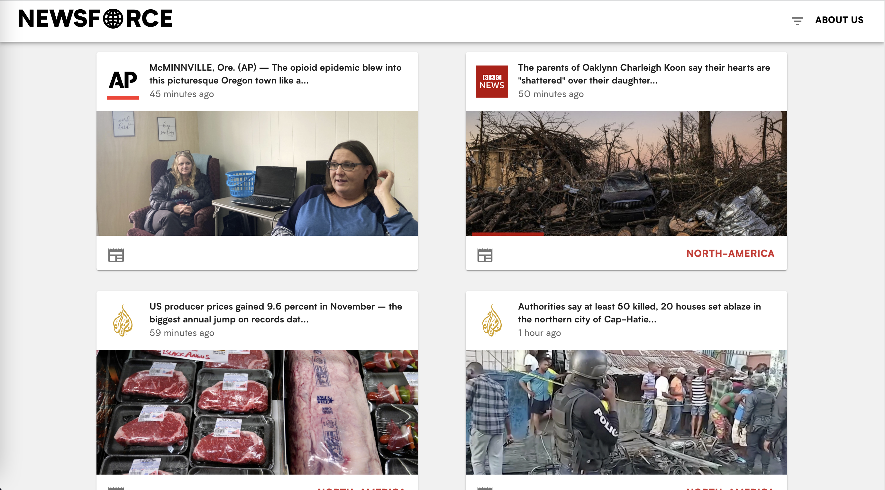
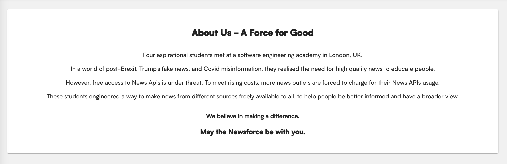
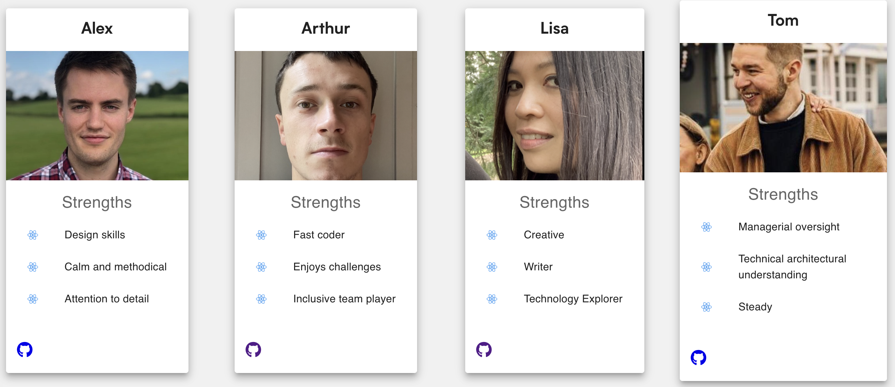

<div align="center">


[Link to video presentation](https://youtu.be/B76vAgGgh4I?t=168)

</div>

#### Table of Contents

- [Preview](#Preview)
- [Features](#Features)
- [Install](#Install)
- [Stack](#Stack)
  - [Project](#Project)
  - [Testing](#Testing)
- [Team](#Team)

<div align="center" >

## Preview



&nbsp;


&nbsp;



&nbsp;



&nbsp;

</div>

## Features

- API based news aggregator from several sources.
- Filtering based on publisher.
- Filtering based on continent.
- Continental filtering using an interactive map.

## Install

Clone the repository

```bash
% git clone https://github.com/newsforce/newsforce-front-end-react
```

Go to the project directory and install dependencies:

```bash
% cd newsforce-front-end-react
```

```bash
% yarn
```

Run the server

```bash
% yarn start
```

## Stack

### Project

|                                                                                                                                         | Tool                                      | Use?                                               | Where can I see it?               |
| :-------------------------------------------------------------------------------------------------------------------------------------: | ----------------------------------------- | -------------------------------------------------- | --------------------------------- |
|                                                     | [Ruby on Rails](https://rubyonrails.org/) | Server-side web framework written in Ruby.         | In the back end for our project.  |
|  | [React](https://reactjs.org/)             | A JavaScript library for building user interfaces. | In the front end for our project. |
|                                      | [Heroku](https://www.heroku.com/)         | Cloud platform for deploying web apps.             | Hosting the live site.            |

### Testing

|                                                                                               | Tool                         | Use?                         | Where can I see it?                                            |
| :-------------------------------------------------------------------------------------------: | ---------------------------- | ---------------------------- | :------------------------------------------------------------- |
|                    | [RSpec](https://rspec.info/) | Testing tool for Ruby.       | `newsforce-api-rails/spec/*` Unit tests for the app's classes. |
|  | [Jest](https://jestjs.io/)   | JavaScript testing framework | `newsforce-front-end-react/src/*` Feature testing for the app. |

## Team

> Alex &nbsp;&middot;&nbsp;
> GitHub [@starf0g](https://github.com/starf0g) &nbsp;&middot;&nbsp;

> Arthur &nbsp;&middot;&nbsp;
> GitHub [@arthurfincham](https://github.com/arthurfincham) &nbsp;&middot;&nbsp;

> Lisa &nbsp;&middot;&nbsp;
> GitHub [@hamstercat007](https://github.com/hamstercat007) &nbsp;&middot;&nbsp;

> Tom &nbsp;&middot;&nbsp;
> GitHub [@](https://github.com/t-kellett) &nbsp;&middot;&nbsp;
